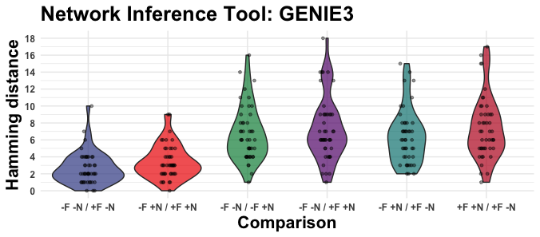

# edgynode
## Statistical Assessment and Visualization of Gene Regulatory Networks

### Motivation

The expression of genes is a fundamental molecular mechanism allowing organisms to produce proteins that govern all functional aspects of living cells. In the past years, complex regulatory mechanisms have been described that place transcription factors (TFs), transposable elements (TEs), and regulatory RNA as main actors governing gene expression. Deciphering these interactions between genes and their regulators in various biological contexts such as development or stress response are of immense interest to life scientists. Given the recent advancements in next-generation sequencing technologies, the inference of these regulatory interactions from (single-cell) RNAseq, ChIPseq, and ATACseq data become feasible and are able to paint a genome-wide picture of gene regulation.

### Short package description

The `edgynode` package imports inferred gene regulatory networks and performs network statistics and network simulation procedures to investigate the topology and structure of the GRN at hand.

## Install `edgynode`

```r
# install edgynode from GitHub
devtools::install_github("drostlab/edgynode")
```

## Tutorials

- [Introduction](https://drostlab.github.io/edgynode/articles/Introduction)

